## Inlämning 2

1,Hur jag har gått tillväga för att skapa en driftsäker server:

Jag började med Visual studio Code för att skapa min första Virtual Machine som jag kallar för CoolAppVM2 i Azure. Tanken är att den ska vara min VM-server som ska ta emot trafik från min huvudserver som kallas för CoolAppVM.
Jag började med att skriva ett script som skapar en VM åt mig med de nödvändiga inställningarna.

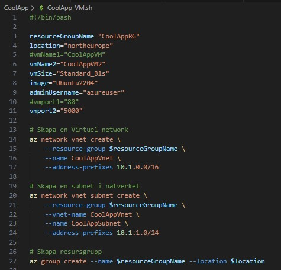

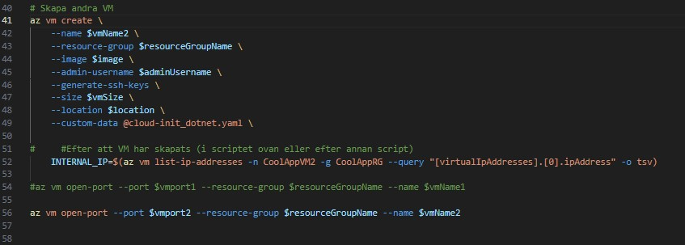

Som bilden visar skapar mitt script en resource group, namnger mitt VM och ställer in size och image åt mig. Denna VM ska ha port 5000. Sen skapar den även ett Virtual Network och ett subnet.
Då första VM jag skapar är till för att ta emot trafik från min huvudserver så vill jag installera dotnet på den. Det har jag med i mitt script i custom data. Den kommer alltså hämta informationen från mitt cloud-init_dotnet.yaml som jag har i samma projektmapp i VSCode.

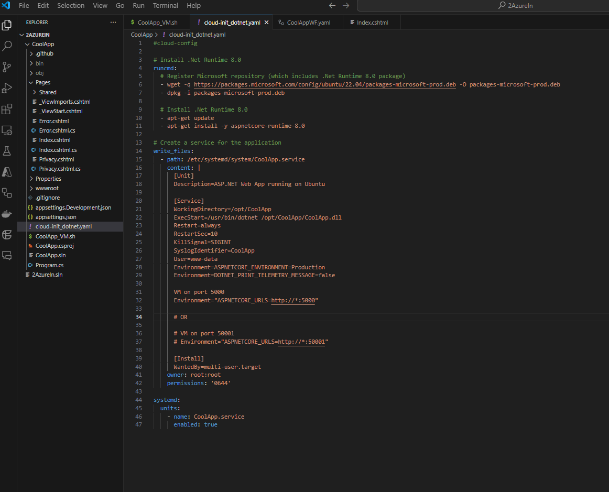

Kontrollera att det har gått rätt till när du har kört scriptet genom att gå till din Azure.

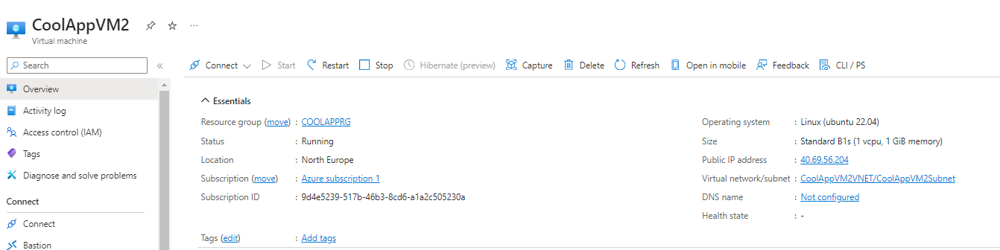

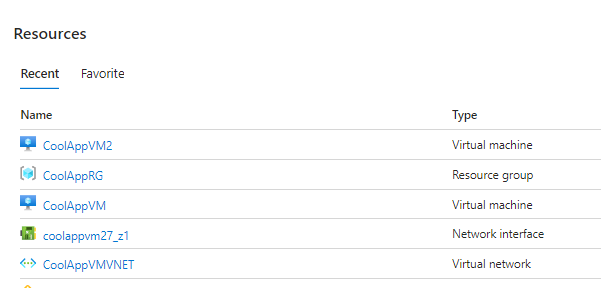

### 2, Nu är det dags att skapa en Github-repo,
 där vi sedan kan pusha vårat projekt från VSCode till Github. Detta kommer att hjälpa oss att få vårat projekt att fungera mer autonomt och även lättare att sammarbeta och jobba i grupp.

 Vi vill först skapa ett Github-repo lokalt i våran dator och det gör man genom att skriva i terminalen

 ### dotnet new webapp 
 
 ### dotnet new gitignore

 ### git init

 ### git add .
 
 ### git commit -m "Initial Commit"

 Nu har du skapat en lokal GitHub-repo och kan spara ditt projekts filer i den. 
 Gå till Source control i VSCode och pusha dina nya ändringar till Github-servern.

 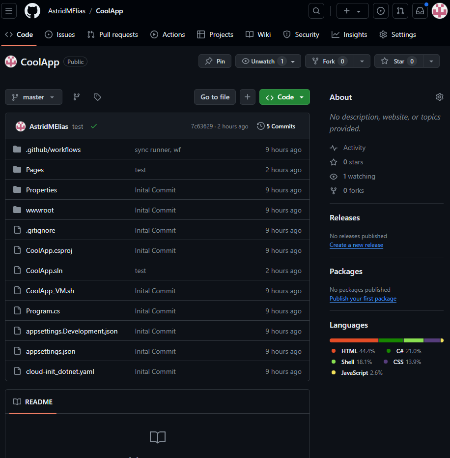

 Nu kan du se dina filer från projektet i repot i Github.

 ### 3 Workflow

 Genom att gå in på Github --> Action --> New Workflow
 skapar du ett workflow till ditt projekt som kommer automatisera körningen och testa ditt program varje gång du pushar från VSCode. 

 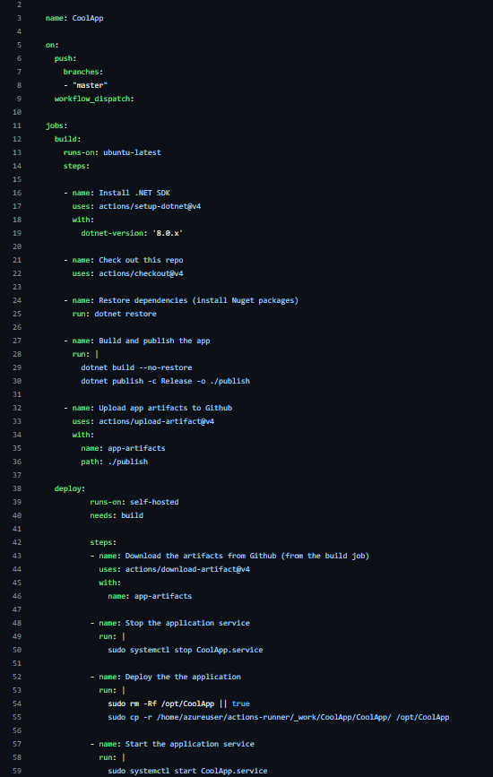

 Kontrollera att det fungerar genom att gå till Action.

 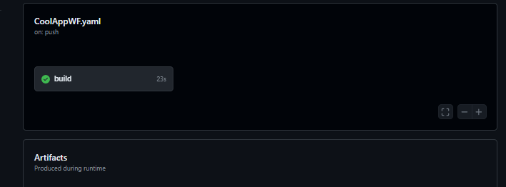

 Men för att workflow ska fungera behöver du även en Runner som kör Workflow.

 I Github --> settings --> Action hittar du Runner. Genom att välja Linux ,x64 så ska du följa stegen i din terminal i VSCode.

 När du har följt stegen så har du nu en runner och för att se att det fungerar så går du in i Action --> runner så ska det vara grönt och stå Idle.

 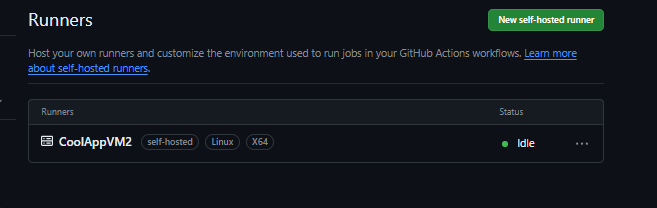

 ### 4 Skapa en VM med Nginx

 Dags att skapa en VM med nginx och det gör man genom att gå in på sin sida i Azure.
Du vill att din vm du skapar nu ska ha samma resource group, Vnet och subnet som din första du skapade.
Men den ska ha port 80. Detta kommer vara din huvudserver.

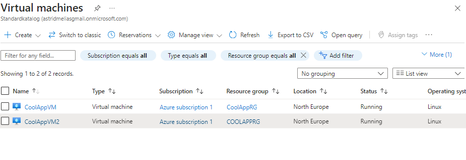

Sen är det att installera nginx genom att skriva kommandot
i VScode-terminalen, 

### sudo apt update && sudo apt install nginx -y

Skriv sedan i terminalen 

### sudo nano /etc/nginx/sites-available/default

och ändra i nano-läget till: 

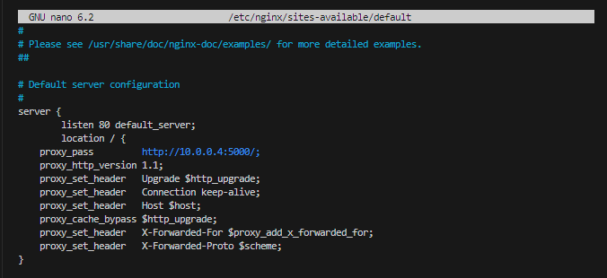

Du ska alltså inte skriva din interna IP från huvudservern, CoolAppVM utan den interna IP från din vm som tar emot trafik från huvudservern, CoolAppVM2.

Kontrollera nu att nginx fungerar genom att skriva i terminalen:

### sudo nginx -t
### sudo systemctl reload nginx

för att ändringarna ska köras på en gång.

Nu har du skapat en reverse proxy som kommr göra det svårare för hackergruppen Cloud of rain att attackera din webbserver genom att dölja din IP-adress och blockerar skadlig trafik.

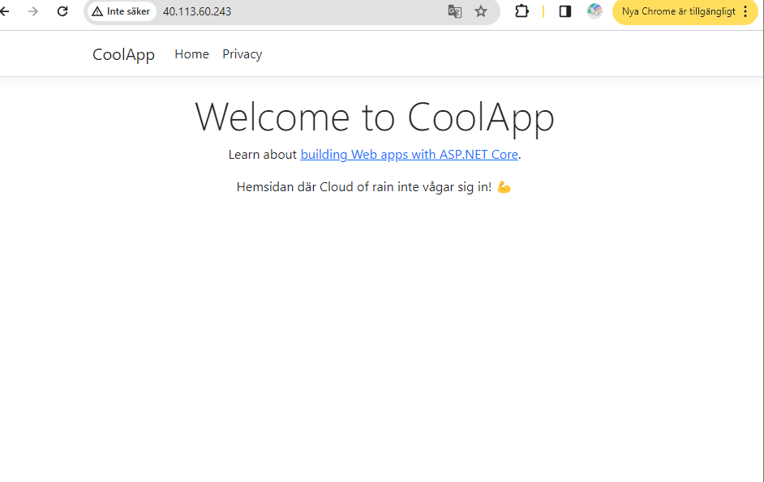

### 5, Jag har gjort en liten skiss på hur det ser ut visuellt 

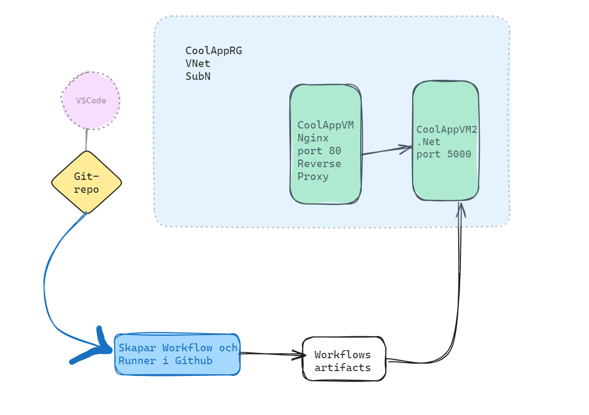

### Tankar

Med denna inlämningen har det varit tufft. Även om jag har tyckt att alla inlämningar har varit svåra så var denna ändå den svåraste. Jag trodde jag skulle hinna med mer men det gjorde jag inte. Men jag är väldigt tacksam över denna uppgiften för att den fick mig tillslut att förstå lite mer hur allt hänger ihop. Jag har fått börja om många gånger och frågat massa frågor till Chatgpt, klasskompisar och youtube om saker jag inte förstår men det är just därför som jag känner att jag har lärt mig mer. Det har varit svårt men kul!

### Koder:

### denna är för att skapa VM. Jag hade först tänkt skapa två vm samtidigt men det blev fel och fick aldrig till det. Så lättast var att skapa en först och sen en annan genom Azure. 

#!/bin/bash

resourceGroupName="CoolAppRG"
location="northeurope"
vmName2="CoolAppVM2"
vmSize="Standard_B1s"
image="Ubuntu2204"
adminUsername="azureuser"
vmport2="5000"

### Skapa en Virtuel network
az network vnet create \
    --resource-group $resourceGroupName \
    --name CoolAppVnet \
    --address-prefixes 10.1.0.0/16

### Skapa en subnet i nätverket
az network vnet subnet create \
    --resource-group $resourceGroupName \
    --vnet-name CoolAppVnet \
    --name CoolAppSubnet \
    --address-prefixes 10.1.1.0/24

### Skapa resursgrupp
az group create --name $resourceGroupName --location $location

### Skapa andra VM
az vm create \
    --name $vmName2 \
    --resource-group $resourceGroupName \
    --image $image \
    --admin-username $adminUsername \
    --generate-ssh-keys \
    --size $vmSize \
    --location $location \
    --custom-data @cloud-init_dotnet.yaml \

    INTERNAL_IP=$(az vm list-ip-addresses -n CoolAppVM2 -g CoolAppRG --query "[virtualIpAddresses].[0].ipAddress" -o tsv)

#az vm open-port --port $vmport1 --resource-group $resourceGroupName --name $vmName1

az vm open-port --port $vmport2 --resource-group $resourceGroupName --name $vmName2

## I CoolAppVM-filen anropar den cloud-init_dotnet.yaml

#cloud-config

### Install .Net Runtime 8.0
runcmd:
  ### Register Microsoft repository (which includes .Net Runtime 8.0 package)
  - wget -q https://packages.microsoft.com/config/ubuntu/22.04/packages-microsoft-prod.deb -O packages-microsoft-prod.deb
  - dpkg -i packages-microsoft-prod.deb

 ### Install .Net Runtime 8.0
  - apt-get update
  - apt-get install -y aspnetcore-runtime-8.0

### Create a service for the application
write_files:
  - path: /etc/systemd/system/CoolApp.service
    content: |
      [Unit]
      Description=ASP.NET Web App running on Ubuntu

      [Service]
      WorkingDirectory=/opt/CoolApp
      ExecStart=/usr/bin/dotnet /opt/CoolApp/CoolApp.dll
      Restart=always
      RestartSec=10
      KillSignal=SIGINT
      SyslogIdentifier=CoolApp
      User=www-data
      Environment=ASPNETCORE_ENVIRONMENT=Production
      Environment=DOTNET_PRINT_TELEMETRY_MESSAGE=false

      VM on port 5000
      Environment="ASPNETCORE_URLS=http://*:5000"

      [Install]
      WantedBy=multi-user.target      
    owner: root:root
    permissions: '0644'

systemd:
  units:
    - name: CoolApp.service
      enabled: true